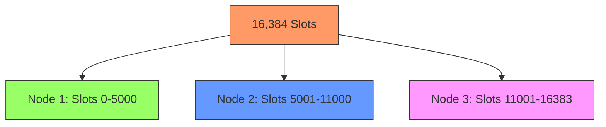
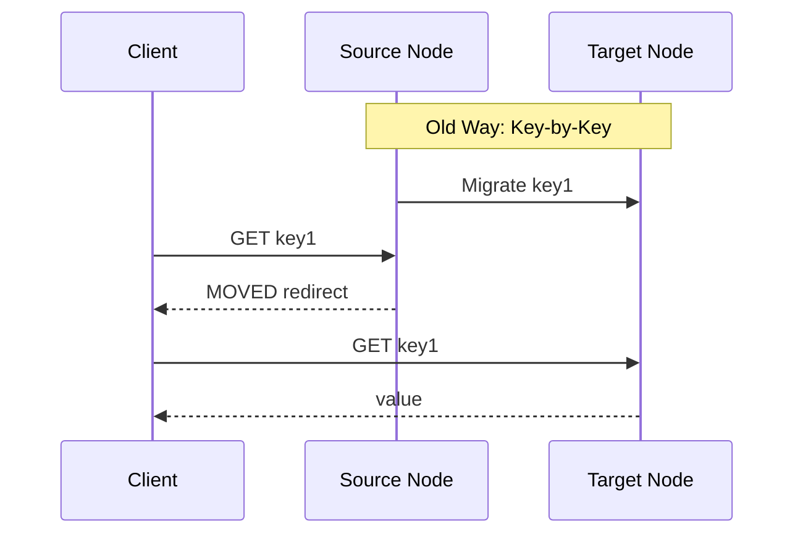
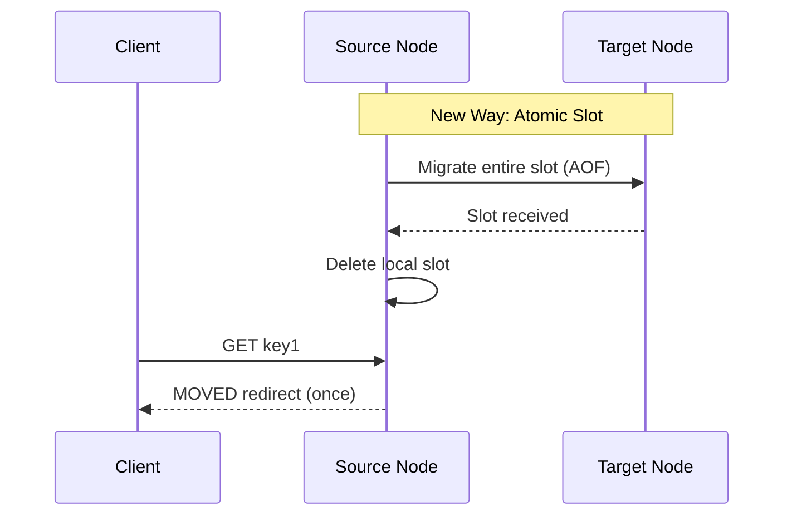
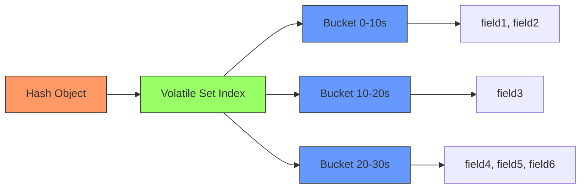
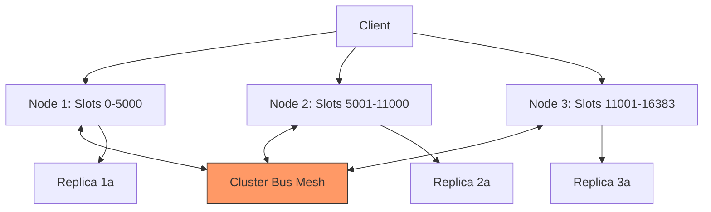

# Valkey 9.0
## Innovation, Features, and Improvements

The Second Major Release

<div class="pt-12">
  <span @click="$slidev.nav.next" class="px-2 py-1 rounded cursor-pointer" hover="bg-white bg-opacity-10">
    Press Space for next page <carbon:arrow-right class="inline"/>
  </span>
</div>

---
layout: intro
---

# Who Am I?

<div class="leading-8 opacity-80">

**Senior Developer Advocate Open Source @ Valkey**

My Mission:
- 🤝 Engage with the Valkey community
- 📝 Create valuable content & demos
- 🎤 Speak at events about Valkey
- 💬 Advocate for community needs
- 🔧 Contribute code and review PRs

</div>

---
layout: center
class: text-center
---

# What's New in Valkey 9.0?

<v-clicks>

🔄 **Atomic Slot Migrations**

🔐 **Hash Field Expiration**

🗄️ **Numbered Databases in Cluster**

⚡ **1 Billion RPS Performance**

🚀 **Much, Much More**

</v-clicks>

---
layout: two-cols
---

# The Journey So Far

<v-clicks>

- **Valkey 7.2** - First release (March 2024)
- **Valkey 8.0** - Major improvements
- **Valkey 9.0** - Innovation milestone

</v-clicks>

::right::

<v-clicks>

## Built by the Community

<div class="mt-8">

- Dozens of contributors
- Collaborative development
- Open governance
- 100% Open Source

</div>

</v-clicks>

---
layout: section
---

# Feature #1
## Atomic Slot Migrations

---

# The Problem with Key-by-Key Migration

<v-clicks>

**Before Valkey 9.0:**
- Data migrated key-by-key using move-then-delete
- Performance degradation during partial migrations
- Client redirects and retries required
- Large keys could block migrations entirely

**The Pain Points:**
1. 🐌 Clients don't know where keys are during migration
2. ❌ Multi-key operations fail across nodes
3. 🚫 Very large keys exceed input buffer limits
4. 🔧 Manual intervention often required

</v-clicks>

---

# How It Works: Slots

<div class="grid grid-cols-2 gap-4">

<div>



</div>

<div v-click>

**Key Distribution:**
- Each key belongs to exactly one slot
- Slot = CRC16(key) % 16,384
- Slots are distributed across nodes
- Keys in same slot stay together

</div>

</div>

---

# The Solution: Atomic Slot Migration

<v-clicks>

**Valkey 9.0 Approach:**
- Migrate entire slots atomically, not individual keys
- Uses AOF format for efficient transfer
- Original node retains data until complete
- No partial states visible to clients

**Benefits:**
1. ✅ No mid-migration redirects
2. ✅ Multi-key operations always work
3. ✅ Large collections migrate incrementally
4. ✅ Zero data loss risk

</v-clicks>

---

# Migration Comparison



---

# Migration Comparison



---
layout: two-cols
---

# Demo: Atomic Slot Migration

```bash {all|1-3|5-7|9-11|13-15}
# Connect to cluster
valkey-cli -c -p 7000

# Check current slot ownership
CLUSTER NODES

# Create test data in slot
SET mykey{slot1} "value1"
SET mykey{slot1}:2 "value2"

# Initiate slot migration
CLUSTER SETSLOT 5798 MIGRATING node-id

# Migration happens atomically
# No partial state visible
```

::right::

<v-click>

**What You'll See:**
- Single atomic operation
- No mid-migration errors
- Instant failover
- Data consistency maintained

</v-click>

---
layout: section
---

# Feature #2
## Hash Field Expiration

---

# The All-or-Nothing Problem

<v-clicks>

**Before Valkey 9.0:**

```redis
HSET user:1001 name "Alice" session "xyz" flag "temp"
EXPIRE user:1001 300  # Everything expires together!
```

**The Limitation:**
- Could only set TTL on entire hash
- All fields shared one expiration
- Forced awkward workarounds:
  - Multiple keys (memory overhead)
  - External cleanup logic
  - Compromised design

</v-clicks>

---

# Real-World Use Case: Feature Flags

<div class="grid grid-cols-2 gap-4">

<div>

**The Challenge:**

```redis
# Customer feature toggles
HSET features:user:42
  experiment-a true    # 5 min TTL
  rollout-b true       # 30 days
  beta-feature true    # 7 days
```

<v-click>

**Old Solution:**
- Separate keys per flag
- Explosion of key count
- Higher memory usage
- Complex management

</v-click>

</div>

<div v-click>

**New Solution:**

```redis
# Different TTL per field!
HSETEX features:user:42
  experiment-a true
  EX 300

HSETEX features:user:42
  rollout-b true
  EX 2592000

# Clean, efficient, scalable
```

</div>

</div>

---

# How It Works: The Design Challenge

<v-clicks>

**Three Conflicting Goals:**
1. 🎯 Minimal memory overhead
2. ⚡ Fast O(1) lookups
3. 🧹 Efficient cleanup

**Approaches Considered:**
- ❌ Secondary hashtable (inefficient scanning)
- ❌ Radix tree index (54+ bytes overhead)
- ❌ Global sorted structure (O(log N) access)

**The Solution: Coarse Buckets**
- ✅ Fields grouped into time buckets
- ✅ Adaptive encoding based on size
- ✅ 16-29 bytes overhead per field

</v-clicks>

---

# The Volatile Set Architecture



<v-clicks>

**Key Features:**
- Buckets adapt to data distribution
- Different encodings for efficiency
- Active expiration scans expired buckets only
- CPU usage stays under 25%

</v-clicks>

---

# Performance Benchmarks

<div class="grid grid-cols-2 gap-4">

<div>

**Memory Overhead:**
- Base expiration: 8 bytes
- Volatile set tracking: 8-21 bytes
- **Total: 16-29 bytes per field**

**Command Performance:**
- No measurable regression
- HSET/HGET remain O(1)
- New commands match traditional performance

</div>

<div v-click>

**Active Expiration:**
- 10M fields expired efficiently
- CPU usage < 25% maintained
- Cache-friendly for small hashes
- Predictable tail latency

**Under Load:**
- 300K ops/sec sustained
- Memory formula validated
- Expiration keeps pace with ingestion

</div>

</div>

---

# Demo: Hash Field Expiration

```python {all|1-4|6-8|10-12|14-16|18-20|22-24}
from glide import GlideClient, ExpiryType, ExpirySet

# Connect to Valkey
client = GlideClient.create(config)

# Create user profile with mixed data
client.hset("user:1001", 
    {"name": "Alice", "age": "30", "session": "abc123"})

# Set 60s TTL on session only
client.hexpire("user:1001", 60, ["session"])
# Returns: [1] - field will expire

# Check remaining TTL
client.httl("user:1001", ["session"])
# Returns: [46] - seconds remaining

# Get absolute expiration time
client.hexpiretime("user:1001", ["session"])
# Returns: [1757499351] - Unix timestamp

# After 60 seconds...
client.hgetall("user:1001")
# Returns: {b'name': b'Alice', b'age': b'30'}
# Session field automatically removed!
```

---

# Use Case: URL Management

<div class="grid grid-cols-2 gap-4">

<div>

```redis
# Link collection with metadata
HSET links:valkey:blogs
  valkey.io/blog/post1
  '{"votes":15,"views":1000}'
  
  valkey.io/blog/post2
  '{"votes":42,"views":5000}'
```

</div>

<div v-click>

**Benefits:**
- Each link has independent TTL
- Active links stay alive
- Inactive links auto-expire
- Refresh TTL on access

```python
# Update and refresh TTL
client.hsetex('links:user:42',
  {'blog-url': '{"clicks":15}'},
  expiry=ExpirySet(
    ExpiryType.MILLSEC, 
    30*24*3600))
```

</div>

</div>

---

# New Commands Available

<div class="grid grid-cols-2 gap-4">

<div>

**Set with Expiration:**
- `HSETEX` - Set field(s) with TTL
- `HEXPIRE` - Set TTL on existing fields
- `HPEXPIRE` - Millisecond TTL

**Query Expiration:**
- `HTTL` - Get remaining seconds
- `HPTTL` - Get remaining milliseconds
- `HEXPIRETIME` - Get Unix timestamp
- `HPEXPIRETIME` - Get millisecond timestamp

</div>

<div v-click>

**Conditional Operations:**
- `HGETEX` - Get and refresh TTL
- Expiration options:
  - `EX` - seconds
  - `PX` - milliseconds
  - `EXAT` - Unix timestamp
  - `PXAT` - millisecond timestamp
  - `PERSIST` - remove TTL

**Fully compatible with Redis 8.0 API**

</div>

</div>

---
layout: section
---

# Feature #3
## Numbered Databases in Cluster Mode

---

# What Are Numbered Databases?

<v-clicks>

**The Concept:**
- Valkey has 16 databases by default (0-15)
- Same key name can exist in each database
- Each points to different data
- Think of it as namespacing

```redis
SELECT 0
SET mykey "value in db 0"

SELECT 5  
SET mykey "value in db 5"  # Different data!

# Both keys coexist independently
```

</v-clicks>

---

# The Historical Problem

<v-clicks>

**Before Valkey 9.0:**
- Numbered databases worked in standalone mode
- **Cluster mode: only DB 0 allowed**
- Advice: "Don't use numbered databases"
- Why? They prevented scaling to cluster

**The Result:**
- Useful patterns were impossible
- Users stuck with single database
- Key prefixing became the workaround

</v-clicks>

---

# Valkey 9.0 Changes Everything

<v-clicks>

**Now in Cluster Mode:**
- ✅ Full support for numbered databases
- ✅ All 16 databases available
- ✅ Each slot contains all databases
- ✅ Clustering still works the same way

**Key Insight:**
- Database number doesn't affect slot assignment
- `CRC16(key) % 16384` still determines slot
- Same key name → same slot → same node
- Just different databases on that node

</v-clicks>

---

# How It Works with Clustering

```redis {all|1-4|6-9|11-14}
# Database doesn't change slot assignment
SELECT 0
SET somekey "hi"
CLUSTER KEYSLOT somekey  # Returns: 11058

SELECT 5
SET somekey "hello"  # Different data
CLUSTER KEYSLOT somekey  # Returns: 11058 (same!)

# Both keys on same node, different databases
SELECT 0
GET somekey  # Returns: "hi"
SELECT 5
GET somekey  # Returns: "hello"
```

---

# Use Case #1: Logical Separation

<v-clicks>

**Multi-Tenant Applications:**

```redis
# Customer A data
SELECT 0
HSET user:1001 name "Alice" plan "premium"

# Customer B data  
SELECT 1
HSET user:1001 name "Bob" plan "basic"

# Customer C data
SELECT 2
HSET user:1001 name "Carol" plan "enterprise"
```

**Benefits:**
- No key name collisions
- Cleaner application code
- Easier debugging
- Simple database swap for testing

</v-clicks>

---

# Use Case #2: The MOVE Command

<v-clicks>

**Temporal Namespacing:**

```redis
# Content flagged for review
SELECT 0
GET post:12345  # Returns: "user content"

# Move to review database (O(1), no copying!)
MOVE post:12345 1  

# Content now inaccessible in main DB
SELECT 0
GET post:12345  # Returns: nil

# But available in review DB
SELECT 1
GET post:12345  # Returns: "user content"
```

**Zero Memory Copy, Instant Operation**

</v-clicks>

---

# Use Case #3: Atomic Complex Key Replacement

<div class="grid grid-cols-2 gap-4">

<div>

**The Challenge:**

```redis
# Need to replace large sorted set
# Traditional approach:
DEL leaderboard
# Then add millions of items
ZADD leaderboard ...
# Reveals partial state!
```

<v-click>

**Performance Issues:**
- Expensive transaction
- Monopolizes node
- Partial state visible
- Long downtime

</v-click>

</div>

<div v-click>

**The Solution:**

```redis
# Build new set in DB 1
SELECT 1
ZADD leaderboard:new ...
# (take your time)

# Atomic swap
SELECT 0
MULTI
  DEL leaderboard
  MOVE leaderboard:new 0
EXEC

# Instant, atomic, no partial state!
```

</div>

</div>

---

# Databases vs Key Prefixing

<div class="grid grid-cols-2 gap-4">

<div>

**Key Prefixing:**

```redis
# app0:user:1001
# app0:session:abc
# app1:user:1001
# app1:session:xyz
```

<v-click>

**Downsides:**
- ❌ Prefix overhead at scale
- ❌ Application code changes
- ❌ Must iterate by pattern
- ❌ More memory usage

</v-click>

</div>

<div v-click>

**Numbered Databases:**

```redis
SELECT 0
SET user:1001 ...

SELECT 1  
SET user:1001 ...
```

**Advantages:**
- ✅ No prefix overhead
- ✅ Simple connection change
- ✅ FLUSHDB works
- ✅ Transparent to app

</div>

</div>

---

# Limitations & Gotchas

<v-clicks>

**Important to Know:**
- ⚠️ No resource isolation (noisy neighbor possible)
- ⚠️ Commands are per-node in cluster:
  - `FLUSHDB` - flushes node's portion only
  - `SCAN` - iterates node's keys only  
  - `DBSIZE` - counts node's keys only
- ⚠️ Limited metrics per database currently
- ⚠️ ACL system doesn't restrict databases yet (PR in progress)

**Client Library Watch-Outs:**
- Some restrict usage to DB 0 in cluster
- Connection pools may not handle SELECT properly
- Check your library's cluster + multi-DB support

</v-clicks>

---

# Demo: Numbered Databases

```redis {all|1-4|6-9|11-14|16-19|21-24}
# Connect to cluster
valkey-cli -c -p 7000

# Work in database 0
SELECT 0
SET user:1001 "Alice in DB 0"
HSET session:1001 token "abc123"

# Switch to database 5
SELECT 5
SET user:1001 "Bob in DB 5"
HSET session:1001 token "xyz789"

# Verify separation
SELECT 0
GET user:1001  # Returns: "Alice in DB 0"

SELECT 5
GET user:1001  # Returns: "Bob in DB 5"

# Atomic move between databases
SELECT 0
MOVE user:1001 10  # Move to DB 10
GET user:1001      # Returns: nil (moved away)
```

---
layout: section
---

# Feature #4
## 1 Billion Requests Per Second

---

# Scaling to Extreme Heights

<v-clicks>

**The Achievement:**
- 🎯 1 billion requests per second
- 🎯 2,000 node cluster
- 🎯 Bounded recovery time
- 🎯 Linear scaling maintained

**What Made This Possible:**
- Cluster bus improvements
- Better failure detection
- Optimized gossip protocol
- Rigorous testing at scale

</v-clicks>

---

# How Valkey Clustering Works



<v-clicks>

**Key Components:**
- 16,384 hash slots distributed across primaries
- Clients route directly to owning node
- Cluster bus handles gossip and coordination
- No central coordinator needed

</v-clicks>

---

# The Cluster Bus

<v-clicks>

**What It Does:**
- Persistent TCP mesh between all nodes
- Gossip-based membership discovery
- PING/PONG heartbeats with topology
- Failure detection and failover
- Epoch-based conflict resolution

**The Challenge at Scale:**
- 2,000 nodes = 2M+ connections
- Gossip amplification
- Failure report storms
- CPU pressure during chaos

</v-clicks>

---

# Major Improvements

<v-clicks>

**1. Multiple Primary Failures**
- Problem: Vote request collisions
- Solution: Ranking-based election order
- Result: Consistent recovery time

**2. Reconnection Storms**
- Problem: 100ms reconnect attempts × 100s of failed nodes
- Solution: Throttling mechanism  
- Result: Bounded CPU usage

**3. Failure Report Tracking**
- Problem: Redundant report processing
- Solution: Radix tree with time buckets
- Result: Efficient cleanup, CPU savings

</v-clicks>

---

# Pub/Sub Optimization

<v-clicks>

**The Problem:**
- Pub/Sub uses cluster bus for message delivery
- Each packet had 2KB metadata overhead
- 16,384 bits for slot ownership info
- Irrelevant for pub/sub messages!

**The Solution:**
- Lightweight message header (~30 bytes)
- Only essential metadata
- **67x reduction in overhead**

**Impact:**
- Better scaling with large clusters
- More efficient message delivery
- Applies to sharded pub/sub too

</v-clicks>

---

# Benchmark Setup

<div class="grid grid-cols-2 gap-4">

<div>

**Infrastructure:**
- AWS r7g.2xlarge instances
- 8 cores, 64GB RAM each
- ARM-based (aarch64)
- 750 client instances (c7g.16xlarge)

**Configuration:**
- 1,000 primary + 1,000 replica nodes
- 6 cores pinned to valkey-server
- 2 cores for network interrupts
- 6 io-threads enabled

</div>

<div v-click>

**Test Parameters:**
```bash
valkey-benchmark \
  -n 100M \
  -c 1000 \
  -t SET \
  -d 512 \
  --threads 20
```

**Results:**
- Linear scaling observed
- 1B RPS achieved with 2,000 nodes
- Minimal cluster bus overhead
- Predictable performance

</div>

</div>

---

# Recovery Time Testing

<v-clicks>

**Failure Simulation:**
- Killed up to 50% of primary nodes
- Used SIGKILL for hard stop
- Measured automatic failover
- Tracked time to cluster OK

**Measurement:**
- From: First PFAIL detection
- To: All slots covered again
- Result: Bounded recovery time
- No manual intervention needed

**Key Insight:**
Even with massive failures, recovery is predictable and automatic.

</v-clicks>

---

# Performance Visualization


<v-click>

**Nearly Perfect Linear Scaling**
- Each primary contributes ~500K RPS
- Cluster overhead remains minimal
- Recovery time stays bounded
- Production-ready at massive scale

</v-click>

---
layout: section
---

# Much, Much More

---

# Additional Performance Improvements

<div class="grid grid-cols-2 gap-4">

<div>

**Pipeline Memory Prefetch**
- Up to 40% higher throughput
- Optimized memory access patterns
- Better CPU cache utilization

**Zero Copy Responses**
- Large requests avoid internal copying
- Up to 20% higher throughput
- Reduced memory pressure

**Multipath TCP**
- 25% latency reduction possible
- Better network resilience
- Improved redundant path utilization

</div>

<div v-click>

**SIMD Optimizations**
- BITCOUNT: 200% faster
- HyperLogLog: 200% faster
- Modern CPU instructions

**New Query Capabilities**
- Geospatial: Query by polygon
- CLIENT LIST: Advanced filtering
- More expressive queries

**Conditional Operations**
- DELIFEQ: Delete if value matches
- Atomic operations
- Safer concurrent access

</div>

</div>

---

# Un-deprecation: Breaking from the Past

<v-clicks>

**Valkey's Stance:**
- API backward compatibility matters
- Community feedback drives decisions
- Re-evaluated 25 deprecated commands

**The Result:**
- ✅ Commands restored to good standing
- ✅ Removed deprecation warnings
- ✅ Official usage recommendation
- ✅ Long-term support commitment

**Examples Include:**
- Numbered databases (obviously!)
- Various utility commands
- Legacy but useful operations

</v-clicks>

---

# And Most Importantly...

<v-click>

<div class="text-center text-6xl mt-20">

🎨 **New LOLWUT Art!**

</div>

<div class="text-center mt-8 opacity-80">

(Because every major release deserves whimsical generative art)

</div>

</v-click>

<v-click>

```redis
LOLWUT VERSION 9
# Generates unique ASCII art for Valkey 9.0
```

</v-click>

---
layout: section
---

# Getting Started with Valkey 9.0

---

# Installation Options

<div class="grid grid-cols-3 gap-4">

<div>

**Binary Download**
```bash
# Download from valkey.io
wget https://valkey.io/\
  download/releases/v9-0-0

tar xzf valkey-9.0.0.tar.gz
cd valkey-9.0.0
make
```

</div>

<div v-click>

**Container Image**
```bash
# Docker
docker pull valkey/valkey:9.0

# Run it
docker run -d \
  -p 6379:6379 \
  valkey/valkey:9.0
```

</div>

<div v-click>

**Build from Source**
```bash
git clone \
  https://github.com/\
  valkey-io/valkey

cd valkey
git checkout 9.0.0
make
```

</div>

</div>

<v-click>

<div class="text-center mt-8">

**Coming Soon to Your Favorite Linux Distribution**

</div>

</v-click>

---

# Quick Start: Standalone Mode

```bash {all|1-3|5-7|9-11|13-15}
# Start Valkey server
cd valkey-9.0.0/src
./valkey-server

# Connect with CLI
./valkey-cli

# Try new features!
HSETEX myuser name "Alice" EX 60
HTTL myuser name

# Select different database
SELECT 5
SET mykey "value in db 5"
```

---

# Quick Start: Cluster Mode

```bash {all|1-3|5-7|9-11|13-15}
# Create cluster directory
mkdir cluster-test
cd cluster-test

# Create config for each node
# Enable cluster-enabled yes
# Set different ports

# Start nodes
./valkey-server node-7000.conf
./valkey-server node-7001.conf
# ... (repeat for all nodes)

# Create cluster
./valkey-cli --cluster create \
  127.0.0.1:7000 127.0.0.1:7001 \
  --cluster-replicas 1
```

---

# Client Libraries

<div class="grid grid-cols-2 gap-4">

<div>

**Official Support:**
- [valkey-glide](https://github.com/valkey-io/valkey-glide) (Python, Node.js, Java)
- [Jedis](https://github.com/valkey-io/jackey) (Java)
- [node-valkey](https://github.com/valkey-io/node-valkey) (Node.js)
- Go, Rust, and more!

</div>

<div v-click>

**Hash Field Expiration:**
- Available in valkey-glide 2.1.0+
- Compatible with Redis 8.0 API
- Drop-in replacement for existing code
- New commands: HSETEX, HEXPIRE, HTTL

**Check Compatibility:**
- Some libraries may need updates
- Numbered databases in cluster
- Always use latest versions

</div>

</div>

---

# Configuration Tips

```conf {all|1-2|4-5|7-8|10-11|13-14}
# Enable cluster mode
cluster-enabled yes

# Number of databases (default: 16)
databases 16

# IO threads for performance
io-threads 6

# Memory management
maxmemory 50gb

# Cluster configuration
cluster-require-full-coverage no
cluster-allow-reads-when-down yes
```

---
layout: section
---

# Real-World Use Cases

---

# Use Case: Session Management

```python
from glide import GlideClient, ExpirySet, ExpiryType

# User session with different TTLs
client.hset("session:user123", {
    "user_id": "123",
    "username": "alice",
    "role": "admin"
})

# Short-lived access token
client.hexpire("session:user123", 300, ["access_token"])

# Longer session cookie
client.hexpire("session:user123", 3600, ["session_cookie"])

# User data persists, tokens expire independently
```

---

# Use Case: Multi-Tenant SaaS

```python
# Separate customer data by database
def get_customer_connection(customer_id):
    db_num = customer_id % 16  # Distribute across DBs
    return client.select(db_num)

# Customer A (DB 0)
client.select(0)
client.hset("config", {"theme": "dark", "lang": "en"})

# Customer B (DB 1)  
client.select(1)
client.hset("config", {"theme": "light", "lang": "es"})

# No key collisions, clean separation
```

---

# Use Case: Feature Flag System

```python
# Store all flags in one hash
flags_key = "features:user:12345"

# Set flags with different lifespans
client.hsetex(flags_key, {
    "beta-ai-chat": "true",          # 7 days
}, expiry=ExpirySet(ExpiryType.SEC, 604800))

client.hsetex(flags_key, {
    "experiment-widget": "true",     # 1 hour
}, expiry=ExpirySet(ExpiryType.SEC, 3600))

client.hsetex(flags_key, {
    "premium-features": "true",      # 30 days
}, expiry=ExpirySet(ExpiryType.SEC, 2592000))

# Each flag expires independently!
```

---

# Use Case: Content Moderation

```redis {all|1-3|5-7|9-11|13-15}
# User posts content
SELECT 0
HSET post:12345 author "user123" content "..." status "live"

# Content flagged, move to review
MOVE post:12345 1  # O(1) operation, no copy!

# Content now invisible to users
SELECT 0
GET post:12345  # Returns: nil

# But available to moderators
SELECT 1
HGET post:12345 status  # Returns: "live"
# After review: MOVE back to DB 0 or delete
```

---

# Use Case: Cache with Granular Expiry

```python
# Product catalog cache
product_key = "product:laptop-123"

client.hset(product_key, {
    "name": "SuperBook Pro",
    "price": "1299.99",
    "description": "...",
    "inventory": "42",
    "rating": "4.5"
})

# Price changes frequently - 5 min cache
client.hexpire(product_key, 300, ["price", "inventory"])

# Description rarely changes - 24 hour cache
client.hexpire(product_key, 86400, ["description", "name"])

# Efficient memory usage, optimal freshness
```

---
layout: section
---

# Migration Guide

---

# Migrating to Valkey 9.0

<v-clicks>

**From Valkey 8.x:**
- ✅ Seamless upgrade path
- ✅ No breaking changes
- ✅ New features opt-in
- ✅ Backward compatible

**From Redis:**
- ✅ Drop-in replacement
- ✅ Same protocol
- ✅ Compatible commands
- ✅ Client libraries work

**Key Differences:**
- Numbered databases now work in cluster!
- New hash field expiration commands
- Performance improvements automatic

</v-clicks>

---

# Testing Hash Field Expiration

```python {all|1-5|7-11|13-17|19-23}
# Test existing hashes still work
def test_backward_compatibility():
    client.hset("legacy:hash", {"field": "value"})
    assert client.hget("legacy:hash", "field") == "value"
    # No TTL - works as before

# Test new expiration features
def test_field_expiration():
    client.hset("test:hash", {"temp": "data", "perm": "data"})
    client.hexpire("test:hash", 1, ["temp"])
    # "temp" expires, "perm" remains

# Test HSETEX convenience
def test_hsetex():
    client.hsetex("user:session", 
        {"token": "abc"},
        expiry=ExpirySet(ExpiryType.SEC, 300))
    assert client.httl("user:session", ["token"])[0] > 0

# Verify no performance impact
def test_performance():
    # Benchmark HSET/HGET with and without TTLs
    # Should show no regression
```

---

# Testing Numbered Databases

```python {all|1-5|7-11|13-17}
# Test database isolation
def test_database_separation():
    client.select(0)
    client.set("key", "value0")
    assert client.get("key") == "value0"
    
    client.select(1)
    client.set("key", "value1")
    assert client.get("key") == "value1"
    
    # Keys are independent

# Test MOVE operation
def test_move_command():
    client.select(0)
    client.set("moveme", "data")
    assert client.move("moveme", 1) == 1
    
    assert client.get("moveme") is None  # Gone from DB 0
    
    client.select(1)
    assert client.get("moveme") == "data"  # Present in DB 1
```

---

# Testing in Production

<v-clicks>

**Gradual Rollout Strategy:**

1. **Canary Testing**
   - Deploy to small subset of nodes
   - Monitor performance metrics
   - Compare with Valkey 8.x baseline

2. **Feature Adoption**
   - Start with numbered databases
   - Test hash field expiration in staging
   - Measure memory usage

3. **Performance Validation**
   - Run load tests
   - Monitor latency percentiles
   - Check cluster bus metrics

4. **Full Deployment**
   - Roll out to entire fleet
   - Monitor recovery times
   - Validate at scale

</v-clicks>

---
layout: section
---

# Performance Optimization Tips

---

# Hash Field Expiration Best Practices

<v-clicks>

**Memory Optimization:**
- Group fields with similar TTLs
- Reduces bucket overhead
- More efficient cleanup

**Performance Tips:**
- Use HSETEX for new fields
- Avoid frequent TTL updates
- Batch operations when possible

**Monitoring:**
- Track active expiration CPU usage
- Watch memory growth patterns
- Monitor field count per hash

</v-clicks>

---

# Numbered Databases Best Practices

<v-clicks>

**When to Use:**
- ✅ Logical data separation
- ✅ Multi-tenant applications (with caution)
- ✅ A/B testing and staging
- ✅ Temporal operations with MOVE

**When to Avoid:**
- ❌ Need resource isolation
- ❌ Strict QoS requirements
- ❌ Very large database counts
- ❌ Critical noisy neighbor concerns

**Tips:**
- Limit active databases to what you need
- Document database usage patterns
- Monitor per-database metrics when available
- Test client library compatibility

</v-clicks>

---

# Cluster Scaling Guidelines

<v-clicks>

**Node Planning:**
- Each primary: ~500K-1M RPS capacity
- Plan for 1:1 primary:replica ratio
- Consider AZ placement

**Network Configuration:**
- Pin cores for network interrupts
- Enable io-threads (6 recommended)
- Use multipath TCP if available

**Monitoring Points:**
- Cluster bus CPU usage
- Failure detection time
- Slot migration duration
- Recovery time metrics

</v-clicks>

---
layout: section
---

# Community and Contributing

---

# Join the Valkey Community

<div class="grid grid-cols-2 gap-8">

<div>

**Get Help:**
- 💬 GitHub Discussions
- 💬 Slack workspace
- 📚 Documentation at valkey.io
- 🐛 Issue tracker

**Stay Updated:**
- 📝 Blog posts and tutorials
- 🎥 Conference talks
- 📱 Social media (@valkey-io)
- 📧 Mailing lists

</div>

<div v-click>

**Contribute:**
- 🔧 Code contributions
- 📖 Documentation improvements
- 🐛 Bug reports and fixes
- 💡 Feature suggestions

**Get Involved:**
- Community calls
- Technical Steering Committee
- Special Interest Groups
- Conference presentations

</div>

</div>

---

# Contributing to Valkey

<v-clicks>

**Ways to Contribute:**

1. **Code**
   - Fix bugs, add features
   - Improve performance
   - Write tests

2. **Documentation**
   - Command references
   - Tutorials and guides
   - Example applications

3. **Community**
   - Answer questions
   - Review PRs
   - Share use cases
   - Write blog posts

4. **Testing**
   - Test releases
   - Report issues
   - Benchmark features

</v-clicks>

---

# Valkey Governance

<v-clicks>

**Open and Collaborative:**
- Linux Foundation project
- Technical Steering Committee
- Transparent decision making
- Community-driven roadmap

**Core Principles:**
- 100% Open Source (BSD 3-Clause)
- Vendor neutral
- Meritocratic contribution
- Backward compatibility

**Major Contributors:**
- AWS, Google, Oracle, Alibaba
- Individual contributors
- Company-sponsored developers
- Community volunteers

</v-clicks>

---
layout: section
---

# What's Next for Valkey?

---

# Future Roadmap

<v-clicks>

**Performance:**
- SWIM protocol for cluster bus
- Offload cluster bus to separate thread
- More SIMD optimizations
- Better memory prefetching

**Features:**
- Per-database metrics
- ACL support for databases
- Compressed hash encodings
- Hierarchical time wheels for expiration

**Operational:**
- Better observability
- AZ-aware failover
- Enhanced monitoring
- Improved tooling

</v-clicks>

---

# Experimental Features to Watch

<v-clicks>

**Coming Soon:**
- More granular resource controls
- Enhanced cluster topology awareness
- Advanced replication features
- New data structures

**Community Requests:**
- Database-level access controls (in progress)
- Per-database monitoring
- Multi-region improvements
- Performance profiling tools

**Get Involved:**
- Join SIGs (Special Interest Groups)
- Contribute to RFCs
- Test experimental features
- Share your use cases

</v-clicks>

---
layout: section
---

# Q&A and Demo Time

---

# Live Demo Setup

<div class="grid grid-cols-2 gap-4">

<div>

**Environment:**
```bash
# Start local cluster
cd valkey-9.0.0
./utils/create-cluster/\
  create-cluster start

./utils/create-cluster/\
  create-cluster create
```

</div>

<div v-click>

**Demo Scenarios:**
1. Hash field expiration in action
2. Numbered databases with MOVE
3. Atomic slot migration
4. Performance comparison

**Interactive:**
- Live commands
- Real-time monitoring
- Performance metrics
- Question-driven exploration

</div>

</div>

---

# Common Questions

<v-clicks>

**Q: Is Valkey production-ready?**
A: Yes! Used at massive scale by major companies.

**Q: Can I migrate from Redis?**
A: Yes! Drop-in replacement, same protocol.

**Q: What about Redis Modules?**
A: Some work, check compatibility. Native Valkey modules growing.

**Q: How do I get support?**
A: Community support via GitHub/Slack. Commercial support available from partners.

**Q: What's the upgrade path?**
A: Seamless from Valkey 8.x. Test thoroughly when migrating from Redis.

</v-clicks>

---
layout: center
class: text-center
---

# Thank You!

<div class="mt-8 opacity-80">

**Get Valkey 9.0 Today**

📦 valkey.io/download

📚 valkey.io/docs

💬 github.com/valkey-io/valkey

🐛 github.com/valkey-io/valkey/issues

</div>

<div class="mt-12">

**Let's build the future of in-memory data together!**

</div>

---
layout: end
---

# Questions?

<div class="text-center opacity-80">

Find me at:
- GitHub: @[your-handle]
- Twitter: @[your-handle]  
- Email: [your-email]

</div>
